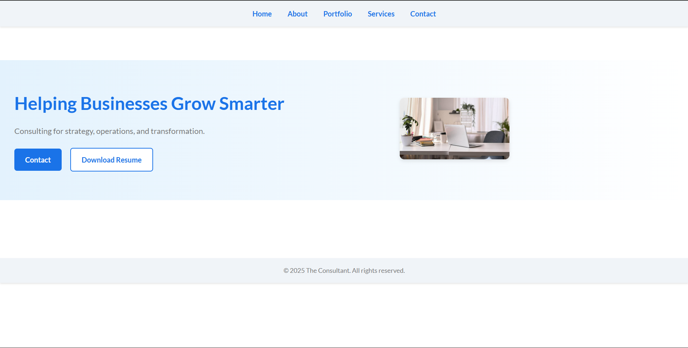

# DevDay: Modern Web Interface 
**Category:** Frontend Development  
**Tech Stack:** HTML5, CSS3  
**Status:** Certified Project  

##  Overview
DevDay is a responsive web project designed to showcase a modern and professional event-style interface. This project was developed as a final assessment to demonstrate proficiency in core web technologies, responsive design principles, and structured content management.

##  Visual Preview

##  Key Features
* **Responsive Web Design:** Fully optimized for mobile, tablet, and desktop viewports using CSS Flexbox/Grid.
* **Modern UI/UX:** A clean, user-centric design focused on readability and aesthetic appeal.
* **Semantic HTML:** Follows best practices for SEO and web accessibility.
* **Custom Styling:** Includes hand-crafted CSS for navigation, hover effects, and layout sections.

##  Certification
This project was completed as part of a Web Development certification program.
* **[View Certification PDF](./DevDay-Certificate.pdf)**

##  Project Files
* **[index.html](./index.html)**: The structural foundation of the project.
* **[style.css](./style.css)**: The styling layer containing custom themes and layouts.
* **[assets/](./assets/)**: Directory for optimized images and icons used throughout the site.

##  How to View
1. Download or clone this folder.
2. Open `index.html` in any modern web browser (Chrome, Firefox, Edge).
